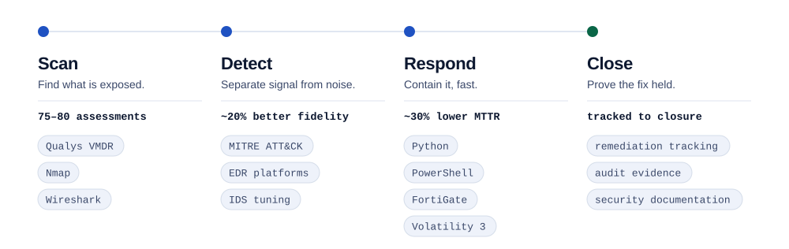
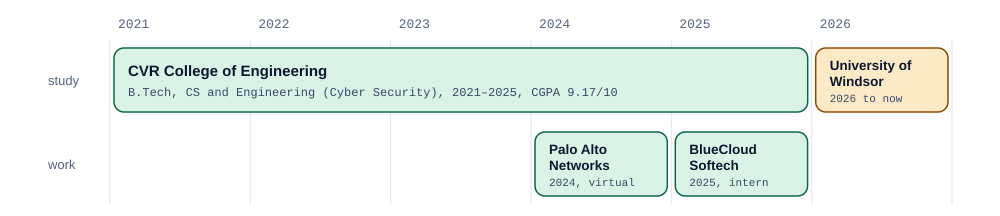
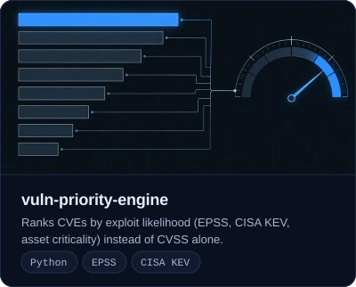
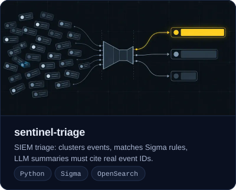
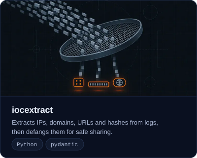
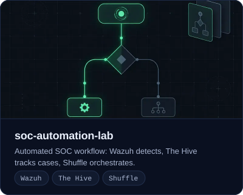
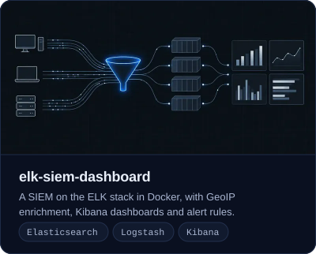
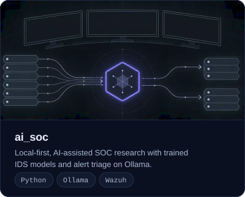

<picture>
  <source media="(prefers-color-scheme: dark)" srcset="assets/ledger-dark.svg">
  <source media="(prefers-color-scheme: light)" srcset="assets/ledger-light.svg">
  
</picture>

I'm a cyber security engineer in the Master of Applied Computing co-op at the University of Windsor. As a security intern at BlueCloud Softech I worked the whole loop on a vulnerability: scan it, triage it, write it up, and chase the fix until it closed.

My work sits where tooling meets process. Qualys and Nmap findings that become tracked remediation, MITRE ATT&CK detection logic, FortiGate and FortiMail hardening, and Python and PowerShell automation that takes hours out of incident response.

  
  
  

## How a finding moves

<picture>
  <source media="(prefers-color-scheme: dark)" srcset="assets/pipeline-dark.svg">
  <source media="(prefers-color-scheme: light)" srcset="assets/pipeline-light.svg">
  
</picture>

## Experience

<picture>
  <source media="(prefers-color-scheme: dark)" srcset="assets/timeline-dark.svg">
  <source media="(prefers-color-scheme: light)" srcset="assets/timeline-light.svg">
  
</picture>

**Cyber Security Intern, BlueCloud Softech Solutions** (2025)

A 15-person security team, covering vulnerability management, detection engineering and incident response.

- Ran 75–80 vulnerability assessments with Qualys VMDR and Nmap, tracking findings, remediation timelines and audit evidence through to closure.
- Standardised EDR agent baselines across 500+ endpoints.
- Built MITRE ATT&CK-aligned detection logic that lifted lateral-movement and process-anomaly detection fidelity by about 20%.
- Automated credential revocation and host isolation in Python and PowerShell against firewall and threat-intel APIs, contributing to about 30% lower MTTR.
- Supported forensic analysis and containment on a compromised AWS EC2 instance, and hardened FortiGate rules plus SPF, DKIM and DMARC on FortiMail.

**Virtual Intern, Palo Alto Networks** (2024, virtual job simulation)

- Tuned intrusion detection and firewall policy, raising threat-identification accuracy by 35%.
- Consolidated 10 threat-intelligence APIs into a single interface, halving analysis time.

**Education.** Master of Applied Computing (co-op), University of Windsor, 2026 to present. B.Tech in Computer Science and Engineering (Cyber Security), CVR College of Engineering, 2021–2025, CGPA 9.17/10.

## Selected work

  
  

  
  

  
  

**Coursework and research**

- **Digital forensics lab.** Staged a breach in an isolated VM lab, then reconstructed it: disk with Autopsy, memory with Volatility 3, network with Wireshark, with chain-of-custody records and SHA-256 evidence hashing.
- **Cryptographic key management system.** Python and Flask, with AES-GCM, RSA-OAEP and PBKDF2 for key storage, plus key rotation, revocation, audit logging and role-based access.
- **Cloud storage security on blockchain.** Elliptic-curve encryption with Ethereum smart contracts for hash-based integrity checks.
- **Published paper (co-author).** Botnet detection on the Bot-IoT dataset with Decision Tree, Random Forest and 1D-CNN models, in the International Journal of Research Publication and Reviews (IJRPR).

Also comfortable with Autopsy and FTK Imager, Java, C, JavaScript, Flask, Git, and AWS and Azure fundamentals.

I'm open to opportunities. Email is the quickest way to reach me.
