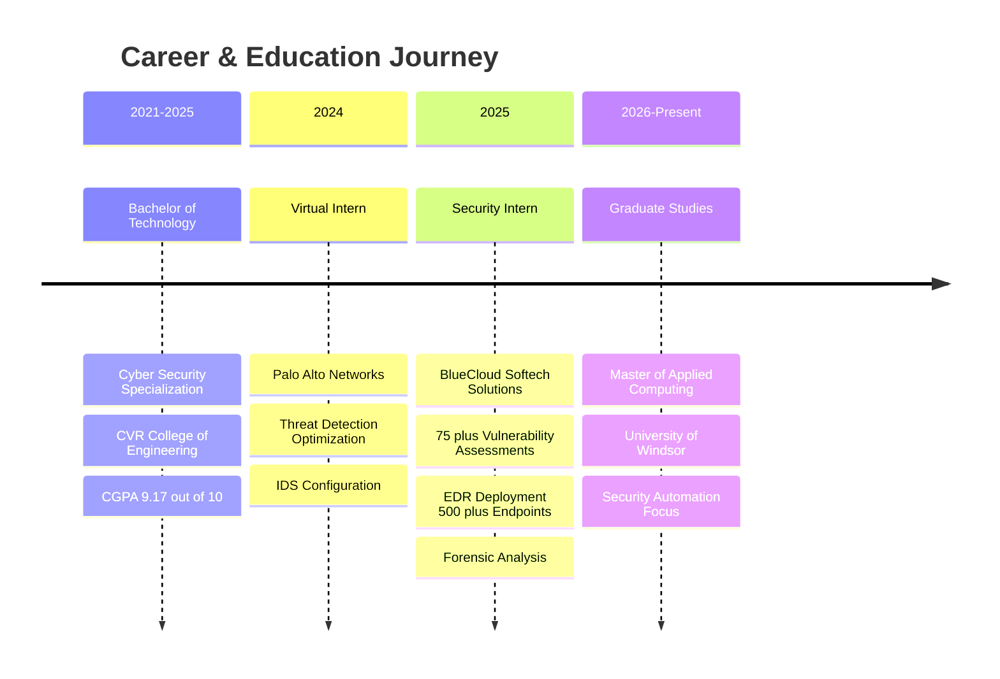
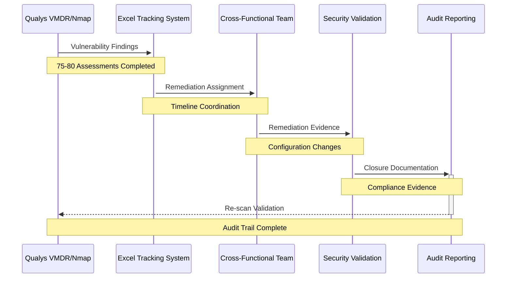
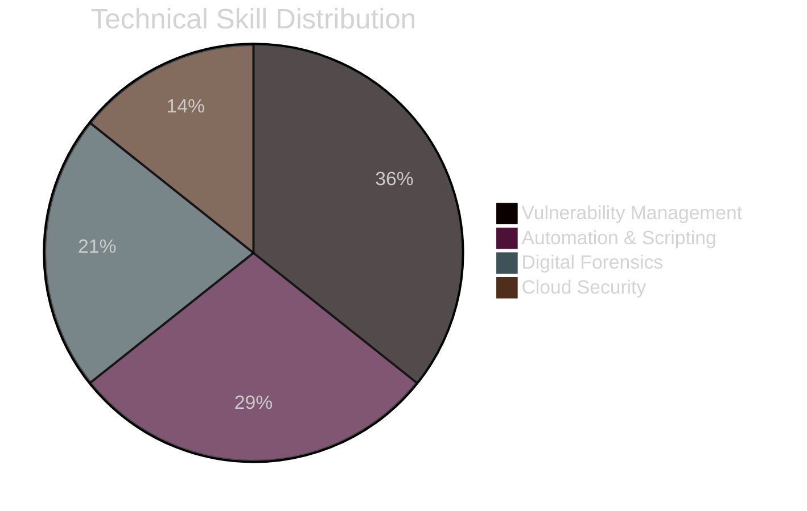

<div align="center">


[](https://linkedin.com/in/TanusreeReddy)
[](mailto:gavinno@uwindsor.ca)
[](#)

</div>

---

## 🎯 Professional Overview

Cyber security engineer with hands-on experience in **vulnerability assessment**, **detection engineering**, **security automation**, and **cyber risk reporting** across consulting-style, cross-functional teams. Currently pursuing a **Master of Applied Computing (Co-op)** at the University of Windsor.

My work sits where tooling meets process: scanner findings that become tracked remediation, MITRE ATT&CK detection logic, firewall and email hardening, and Python and PowerShell automation that takes hours out of incident response. At BlueCloud Softech I ran that loop end to end: scan it, triage it, write it up, and chase the fix until it closed.

**Core Expertise:** Vulnerability management • Security documentation & policy development • Digital forensics & incident response • Threat intelligence integration • Python/PowerShell automation • MITRE ATT&CK framework implementation

**Portfolio:** [tanusreereddy.com](https://tanusreereddy.com) • **Status:** Open to opportunities

---

## 🤖 AI, ML & GenAI Workflow

```mermaid
%%{init: {'theme':'dark'}}%%
graph TB
    subgraph ML["ML: Botnet Detection"]
        A[Bot-IoT Dataset<br/>network traffic] --> B[Decision Tree]
        A --> C[Random Forest]
        A --> D[1D-CNN<br/>deep learning]
        B --> E[Attack Classification<br/>DDoS / DoS / Data Theft / Reconnaissance]
        C --> E
        D --> E
    end

    subgraph GEN["GenAI: LLM Triage"]
        F[Endpoint and Auth Events] --> G[Correlate and Detect<br/>Sigma rules, MITRE ATT&CK]
        G --> I[LLM Triage<br/>function calling + cited event IDs]
        I --> J{Citations match<br/>real events?}
        J -->|Yes| K[Analyst Review Queue<br/>approve / reject / escalate]
        J -->|No| L[Assessment Rejected<br/>not trusted]
        I -.->|scored on labeled data| M[Eval Harness<br/>precision / recall / FPR]
    end

    E ~~~ F

    classDef data fill:#1f2a44,stroke:#60a5fa,color:#ffffff
    classDef model fill:#2d1f44,stroke:#a78bfa,color:#ffffff
    classDef gate fill:#3b2f10,stroke:#f5b14c,color:#ffffff
    classDef stop fill:#3a1a1a,stroke:#f87171,color:#ffffff
    classDef ok fill:#0f3a2e,stroke:#34d399,color:#ffffff
    class A,F,G data
    class B,C,D,I model
    class J gate
    class L stop
    class E,K,M ok
    style ML fill:#0d1117,stroke:#334155
    style GEN fill:#0d1117,stroke:#334155
```



**ML:** the pipeline from my co-authored IJRPR paper on IoT botnet detection: Decision Tree, Random Forest and 1D-CNN models on the Bot-IoT dataset, reporting over 99% accuracy.

**GenAI:** the triage workflow in [sentinel-triage](https://github.com/tanu-1309/sentinel-triage). The LLM has to cite real event IDs, and a check rejects any assessment whose citations are not in the incident. By default it runs offline against a deterministic stand-in for the LLM client, with an OpenAI function-calling adapter for real use.

---

## 💼 Professional Timeline



---

## 🔐 Vulnerability Management Pipeline



---

## 💻 Technical Arsenal

### 🔴 Programming & Scripting


### 🟠 Security Tools & Platforms


### 🟡 Forensics & Incident Response


### 🟢 Frameworks & Methodologies


### 🔵 Development & Automation


### 🟣 Cloud & Infrastructure


### 🟤 Databases & Data Management


---

## 📊 Expertise Distribution



---

## 🎯 Professional Experience

### 🔹 Cyber Security Intern | BlueCloud Softech Solutions
**Jan 2025 – Dec 2025**

*Vulnerability management, detection engineering and incident response inside a 15-person security team.*

**Vulnerability Assessment & Remediation:**
- Executed **75-80 vulnerability assessments** using Qualys VMDR and Nmap across multiple concurrent engagements
- Managed remediation tracking via Excel-based systems, coordinating closure of security findings across cross-functional teams
- Reduced configuration variance by contributing to EDR agent deployment standardization across **500+ endpoints**

**Detection Engineering & Automation:**
- Developed detection logic aligned to **MITRE ATT&CK framework**, improving lateral movement detection fidelity by ~20%
- Built Python and PowerShell automation scripts integrated with firewall APIs and threat intelligence feeds
- Contributed to **30% reduction in MTTR** through automated credential revocation and host isolation workflows

**Infrastructure Security:**
- Configured FortiGate firewall rules and implemented SPF, DKIM, DMARC policies on FortiMail
- Reduced email spoofing risk and improved network operational efficiency by up to **70%**

**Incident Response:**
- Supported forensic analysis and containment during AWS EC2 compromise investigation
- Identified critical Active Directory and perimeter firewall misconfigurations through infrastructure assessments

**Technologies:** Qualys VMDR, Nmap, EDR Platforms, MITRE ATT&CK, Python, PowerShell, FortiGate, AWS EC2, Active Directory

---

### 🔹 Virtual Intern | Palo Alto Networks
**Jul 2024 – Sep 2024** • Virtual job simulation

**Threat Detection Optimization:**
- Configured and fine-tuned intrusion detection systems (IDS) and firewalls, increasing threat identification accuracy by **35%**
- Integrated threat intelligence platforms, consolidating data from **10 API sources** into unified interface
- Reduced analysis time by **50%** through centralized threat intelligence correlation

**Security Automation:**
- Developed automation scripts for security log analysis and QA task streamlining
- Reduced manual review time by approximately **3 hours per task** through automated workflows

**Knowledge Transfer:**
- Facilitated security awareness sessions on threat detection and incident response strategies for peer teams

**Technologies:** IDS, Firewalls, Threat Intelligence APIs, Python Automation

---

## 🚀 Featured Security Projects

### 🔐 Digital Forensics Investigation Lab
**End-to-End Forensic Analysis Simulation**

Designed and executed a complete digital forensics investigation workflow within an isolated virtual environment, demonstrating practical DFIR capabilities from evidence acquisition through reporting.

**Technical Implementation:**
- Staged realistic security breach scenarios generating forensic artifacts: dropped files, deleted data, manipulated timestamps, persistence mechanisms, and network exfiltration traffic
- Conducted disk forensics with **Autopsy** and memory analysis with **Volatility 3**, recovering deleted artifacts and identifying memory-resident IOCs
- Performed network forensics with **Wireshark** to reconstruct exfiltrated data flows and correlate disk/memory/network evidence
- Documented findings with formal chain-of-custody records and **SHA-256 evidence hashing** for evidentiary integrity

**Technologies:** Autopsy, Volatility 3, Wireshark, VirtualBox, FTK Imager, Python, Windows Registry Analysis, SHA-256 Hashing

**Key Outcomes:**
- Complete incident timeline reconstruction from multi-source evidence
- Demonstrated DFIR best practices aligned with incident response standards
- Validated evidence handling procedures suitable for legal/compliance requirements

---

### 🎯 Sentinel Triage: Automated SIEM Alert Correlation
**[View Repository](https://github.com/tanu-1309/sentinel-triage)**

A trimmed-down, offline-verifiable slice of SIEM alert triage: correlates endpoint and authentication events into candidate incidents, matches Sigma rules mapped to MITRE ATT&CK, and has an LLM summarize each incident with citations that are mechanically checked against the real events.

**Architecture Components:**

```
Endpoint Logs → Redis Streams → OpenSearch → Entity Clustering → Sigma/MITRE Detection → 
LLM Triage (Citation Grounded) → Analyst Review Queue → Eval Harness (Precision/Recall/FPR)
```

**Core Capabilities:**
- **Correlation Engine:** Time-window entity clustering groups events into candidate incidents (15-min default window)
- **Detection Layer:** Practical Sigma rule subset with field selections + count/distinct_count aggregations
- **Triage Automation:** LLM function-calling with mandatory citation grounding (hallucinated event IDs rejected); ships with a deterministic offline client and an OpenAI function-calling adapter for real use
- **Analyst Queue:** SQLite-backed review workflow (approve/reject/escalate with audit trail)
- **Eval Harness:** Automated precision/recall/F1/FPR measurement against labeled datasets
- **Offline by Design:** Redis Streams, OpenSearch and the LLM client each have an in-memory or deterministic stand-in, so the full test suite and eval harness run with no Docker, network or API key

**Measured Results (bundled synthetic dataset, 388 events / 296 incidents):**
- Precision 1.00, recall 0.83, F1 0.91, false-positive rate 0.00
- Impossible-travel recall is 0.50, a documented limitation of windowed correlation, which can split a two-country session into separate incidents

**Bundled Detection Rules (Sigma + MITRE):**
- Brute Force Authentication (T1110/T1110.001): ≥5 failures in 10min
- Impossible Travel Between Successful Logins (T1078): successful logins from ≥2 countries in 30min
- Privilege Use Following Repeated Authentication Failures (T1078/T1068): ≥3 failures and ≥1 privilege use in 15min
- Account Lockout Following Failed Login Burst (T1110.001): ≥4 failures and ≥1 lockout in 10min

---

### 🧮 Vulnerability Priority Engine
**[View Repository](https://github.com/tanu-1309/vuln-priority-engine)**

Turns a scanner's flat CVE list into a ranked, SLA-bucketed remediation queue by weighing how likely a flaw is to be exploited, not just its CVSS severity.

**Core Capabilities:**
- **Scanner Adapters:** Parses Trivy JSON reports and generic CVE CSV exports (the kind Nessus, Qualys and OpenVAS produce) into one normalized finding model
- **Enrichment:** Merges CVSS with EPSS exploit probability, CISA KEV confirmed-exploitation status and asset criticality; runs offline on bundled fixtures, with helpers to refresh from the live EPSS and KEV feeds
- **Risk Scoring:** Configurable weighted score defined in `policy.yaml` (default weights: CVSS 35%, EPSS 35%, KEV 20%, asset criticality 10%) mapped to priority buckets with SLAs; CVEs in the CISA KEV catalog are forced into the critical bucket
- **API:** FastAPI service with auto-generated Swagger docs, a Docker image and 68 tests

**Technologies:** Python, FastAPI, Trivy, EPSS, CISA KEV, Docker

---

### 🔎 iocextract: IOC Extraction and Defanging
**[View Repository](https://github.com/tanu-1309/iocextract)**

Offline blue-team utility that pulls indicators of compromise out of raw logs, emails and threat reports.

**Core Capabilities:**
- **Extraction:** IPv4/IPv6 addresses, domains, URLs, emails and MD5/SHA-1/SHA-256 hashes, returned as a deduplicated, classified JSON result
- **False-Positive Guards:** Rejects version strings such as `1.2.3` and `v1.2.3.4rc1`, out-of-range octets, and treats `invoice.exe` as a filename rather than a domain
- **Defanging:** Defangs indicators for safe sharing (`hxxp://evil[.]com`) and refangs analyst notation on the way in
- **CLI:** JSON and table output, 38 offline tests, standard library plus pydantic only

**Technologies:** Python, pydantic, uv, pytest

---

### 🛡️ SOC Automation Lab
**[View Repository](https://github.com/tanu-1309/soc-automation-lab)**

Automated SOC workflow on local virtual machines using open-source tools, designed to detect, analyze and respond to incidents such as Mimikatz activity.

**Core Capabilities:**
- **Detection:** Wazuh for endpoint monitoring and detection
- **Case Management:** The Hive for incident cases
- **Automation:** Shuffle orchestrating the workflow between tools
- **Enrichment and Alerting:** VirusTotal enrichment of alerts, with email/SMS notification for critical incidents

**Technologies:** Wazuh, The Hive, Shuffle, VirusTotal API

---

### 📊 ELK Stack SIEM Dashboard
**[View Repository](https://github.com/tanu-1309/elk-siem-dashboard)**

SIEM built on the ELK stack for real-time security monitoring, threat detection and incident response, deployed with Docker Compose.

**Core Capabilities:**
- **Log Collection and Parsing:** Filebeat and Logstash ingest logs from firewalls, IDS, servers and applications, with Grok patterns and field normalization
- **Enrichment:** GeoIP mapping of IP addresses
- **Visualization:** Pre-built Kibana dashboards for security monitoring
- **Alerting:** Automated alerts and built-in rules for common attack patterns

**Technologies:** Elasticsearch, Logstash, Kibana, Filebeat, Docker

---

## 📄 Research & Additional Projects

### IoT Botnet Detection using Deep Learning and Machine Learning
**Co-authored publication, International Journal of Research Publication and Reviews (IJRPR)**

Applied Decision Tree, Random Forest and 1D-CNN models to the Bot-IoT dataset to classify network traffic and detect botnet-driven DDoS, DoS, data theft and reconnaissance attacks, reporting over 99% accuracy.

### Other Security Projects
- **Cryptographic Key Management System (CKMS):** Web-based key management system in Python, Flask and SQLite, using AES-GCM, RSA-OAEP and PBKDF2-HMAC-SHA256 for encrypted key storage, with documented key lifecycle (generation, rotation, revocation, audit logging), role-based access control and a reporting dashboard
- **Cloud Security on Blockchain:** Cloud storage architecture combining Elliptic Curve Integrated Encryption with Ethereum smart contracts for hash-based integrity checks; reported 18% fewer false verification errors and 94% data integrity accuracy

---

## 🎓 Education

- **Master of Applied Computing (Co-op)**, University of Windsor • 2026 – Present
- **Bachelor of Technology, Computer Science & Engineering (Cyber Security)**, CVR College of Engineering • 2021 – 2025 • CGPA 9.17 / 10

---

## 📬 Get in Touch

Open to opportunities. The quickest way to reach me is email at [gavinno@uwindsor.ca](mailto:gavinno@uwindsor.ca); you can also find me on [LinkedIn](https://linkedin.com/in/TanusreeReddy) and at [tanusreereddy.com](https://tanusreereddy.com).
